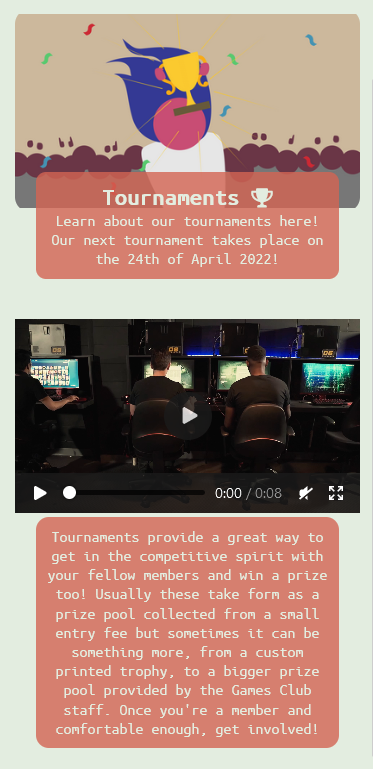
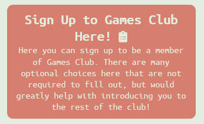
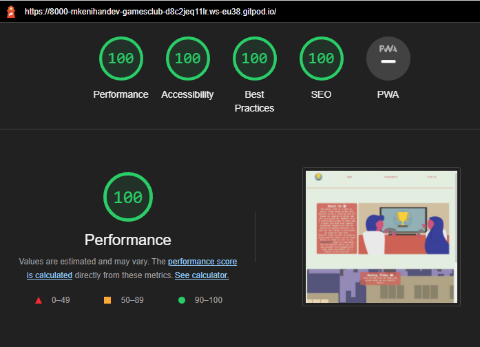
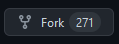

# Games Club Table of Contents

- [Games Club](#games-club)

- [Initial UX Goals and Designs](#initial-ux-goals-and-designs)

- [Features of the Website](#features-of-the-website)

- [Testing and Bug Solving](#testing-and-bug-solving)

- [Deployment](#deployment)

- [Credits](#credits)

# Games Club


The Games Club Website was designed in line with Portfolio Project 1's guidelines and aimed at people looking to join a club of likeminded people looking to play competitive and co-operative games for fun, or to join competitive tournaments to play for prizes.

The Users of this website, the target being people who are enthusiastic about video games, or simply just want to relax with friends, will be provided with all the information they need on both meetups to play games and tournaments alike, as well as how to sign up, and where they can find more information such as social media sites like Facebook or Twitter. 

(Insert image of website layout on different screen sizes)

## Initial UX Goals and Designs
<hr>

To begin with, I had drawn up a simple layout of what I imagined the site to look like, as well as detailed descriptions of how I would want each page to function for the user.


![More details for website, it reads: Sign up page is just for the club, seperate sign up sheet on tournaments page. Sign up includes your preferred platform between PC, Xbox, Playstation or Switch, to better your understanding with other members. In brackets reads "Maybe include a members page in future versions of site?". Social Media links in footer provide users with other methods of finding information about the club, in brackets: "Facebook page posts pics of events, twitter posts meetup times for example". Header always the same as to not confuse the user.](assets/images/readme-images/page2.jpg)

The goal of these sketches and details was to get a rough outline of what a user interested in a Games Club would be looking for, between what the Club actually does, to what times they actually meet up. The basic sketches provided a very simple way to lay the foundations of how I would want the website to look. In particular I wanted this website to look fun and welcoming first and foremost as to reel in anyone interested but also provide an easy, readable experience for any user who is unsure as they don't need difficult website navigation weighing on top of everything else.

## Features of the Website
<hr>

**This website was designed with a mobile-first approach, and as such the images below were taken in a mobile viewport size, the website will still function and change on desktop, however.**

* **Navigation Bar** 
    * The navigation bar displays an icon that the user will become familiar with through the entire site, representing The Games Club logo.
    * The nav-bar features three concise links that bring users to different pages of the site, dedicated to different aspects of the Club.
    * The nav-bar has styling when hovered over to clearly tell the user what link they would be clicking.
    * The nav-bar is in a readable font and color against its background, so the user can clearly see it when they need it. 


* **The Header**
    * The header features a hero image and about us section in one so the user is immediately greeted with what the Club is about.
    * The About Us section clearly tells the user what the Club is for, and explains that meetup times will be displayed below so the user knows to scroll.
    * This section also features a link to the tournaments page directly, in case the user would like to sign up immediately after reading about it.


* **Meetup Times Section**
    * The meetup section is on the homepage so a user of the site can immediately find the most relevant information.
    * This section is a simple list of dates and times displayed over a contrasting image that will expand on larger devices.
    * The section is quick and concise as to not bog the user down with any information they can seek otherwise.


* **Tournaments Page**
    * The tournaments page is designed as a competitive "hook" to entice users to sign up to the club further.
    * The page features an image consistent with the rest of the website, and a quick reminder of when the next tournament is so the most relevant information is immediately available.
    * Below this is a video of some people gaming, it has controls so the user can scrub the video or fullscreen it. It does not autoplay.
    * Below the video, is a more in depth explanation of the tournaments hosted at Games Club.



* **Sign Up Page**
    * The sign up page is the final page a user should have to interact with before entering the club. 
    * First off is an explanation of the upcoming form, which explains that while the user can enter only the required information, it would help other members get to know them if they input more of the optional information.
    * After this is the form. The only required fields in the form are Name, Email and Age. After this all entries are optional.
    * It asks the user what their favorite games and platforms are, so they would be better known by existing members of the club.




* **The Footer**
    * The footer is a very minimalist collection of recognizable icons for the popular sites Facebook, Twitter, and Instagram.
    * Each icon is a clickable link that will take the user to those sites. As this is an imaginary Club, they go directly to the homepage of aforementioned websites.
    * Each link opens in a new tab, as to not take the user back and forth between websites.


## Testing and Bug Solving
<hr>

* **Bugs I solved** 
    * I had a lot of trouble with the homepage image stretching the grid cell, and as such would push content around it. 
        * I wanted the image to be fully visible, as I didn't think it looked very good when zoomed in on mobile devices, using cover.
        * I eventually settled on a 100% 100% approach, for mobile sizes only, so that it would stretch a little bit, but not too much.

    * The sign up page labels were giving me trouble in that they would not display next to my checkboxes, but instead above.
        * This was solved by using styling to display the labels inline, as well as swapping the order of the label and input in the html.

    * Initially running the html through the validator gave issues, as I had used many hyphens to create a large "break" in the html.
        * I first solved this using many tilde instead, but this was eventually advised against by a Mentor on Slack and so was removed.

    * Sharing the "finished" site with friends had one of them discover the meetup-times div had blocked the footer links from being clicked.
        * This was solved by setting the height to min-content on the div.

* **Validation Testing**
    * HTML
        * There were no errors when validated on [W3C Validator](https://validator.w3.org/nu/?doc=https%3A%2F%2Fcode-institute-org.github.io%2Flove-running-2.0%2Findex.html#textarea)

    * CSS
        * There were no errors when passed through the [Jigsaw W3C Validation Service](https://jigsaw.w3.org/css-validator/#validate_by_input+with_options)

    * Accessibility 
        * The site was run through both desktop and mobile Lighthouse and scored above 95 in every section.




## Deployment
<hr>

This website was deployed to GitHub pages. The link can be found here: https://mkenihandev.github.io/Games-Club/

**To clone this repository:**

* Go to the top of the page and click "Fork" in the top right  
* Or by clicking "Code" at the top of the repository then copying the URL 
* Use ```git clone url``` in your Git Bash. 

**To deploy this site locally:** 

* Sign up to https://gitpod.io/ and install the extension for your browser. 
* After this is done you can click the "Gitpod" button at the top of this repository  
* This will automatically set up a new workspace for you.

**To deploy this site remotely:**

* From the project's [repository](https://github.com/mkenihandev/Games-Club), go to the Settings tab.
* From the left-hand menu, select the Pages tab.
* Under the Source section, select the Main branch from the drop-down menu and click Save.
* A message will be displayed to indicate a successful deployment to GitHub pages and provide the live link.

## Credits
<hr>

**Content**
    
* The template for the project was taken from [Code Institutes Full Template](https://github.com/Code-Institute-Org/gitpod-full-template)
* The icons found throughout the website were taken from [Font Awesome website](https://fontawesome.com/)

**Media**

* All the images were made by myself, specifically for the website.
* Credit to RODNAE Productions for the video featured on the tournaments page: https://www.pexels.com/video/men-playing-computer-gaming-7914780/